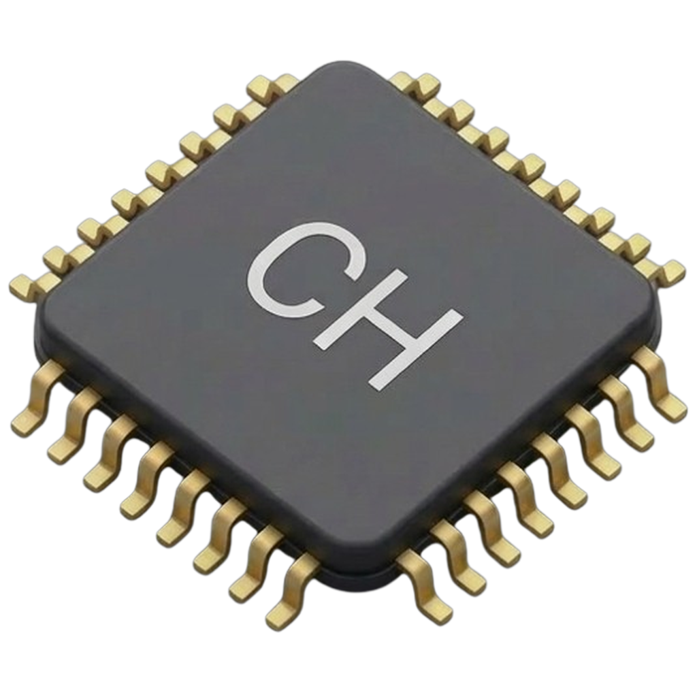
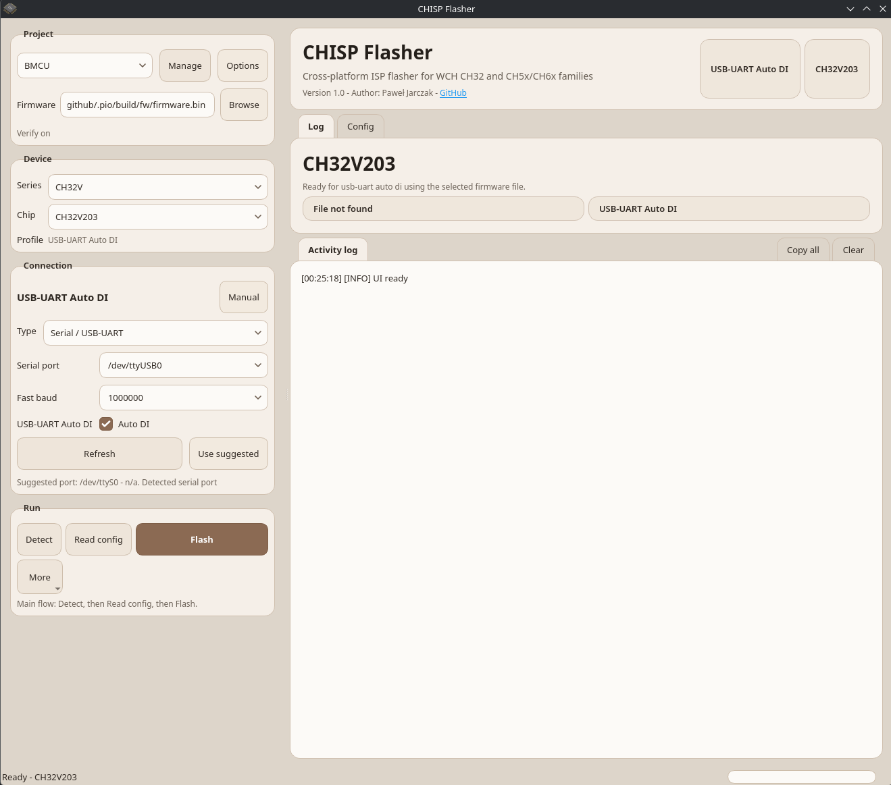

# CHISP Flasher

<p align="center">
  
</p>

Cross-platform ISP flasher for WCH CH32, CH5x and CH6x devices.

## What it does

- flashes firmware images from `.bin`, `.hex`, `.ihex`, `.elf`, `.srec`, `.s19`, `.s28`, `.s37`, `.mot`
- saves and reopens `.chisp` project files
- supports `Serial / USB-UART`
- supports `USB-UART Auto DI`
- supports `Native USB bootloader`
- exposes supported config / option-byte operations from the active chip profile

## Supported operating systems

- Windows
- Linux
- macOS

## Release artifacts

| OS | Artifacts |
| --- | --- |
| Windows | Portable `.zip`, installer `.exe` |
| Linux | Portable `.tar.gz`, `.deb`, `.rpm` |
| macOS | Portable `.zip`, `.dmg` |

## Transport modes

| Mode | Use case | Linux note |
| --- | --- | --- |
| Serial / USB-UART | Manual bootloader entry with a regular USB-UART adapter | Usually works if the user has access to the serial device |
| USB-UART Auto DI | USB-UART bridge wired so the app can drive boot/reset automatically | Same serial-device access rules as above |
| Native USB bootloader | Direct USB bootloader path for supported chips | Usually requires the bundled `50-chisp-flasher.rules` rule when using the portable/manual build |

## Supported chip groups

| Family / group | Examples | Serial / USB-UART | USB-UART Auto DI | Native USB bootloader | Notes |
| --- | --- | --- | --- | --- | --- |
| CH32V00x / CH32M007 | CH32V002, CH32V003, CH32V004, CH32V005, CH32V006, CH32V007, CH32M007 | Yes | No | No | UART-only bootloader path |
| CH32F103 / CH32V103 | CH32F103, CH32V103 | Yes | Yes | Yes | Shared x103 path |
| CH32V20x | CH32V203, CH32V208 | Yes | Yes | Yes | Shared V20x path |
| CH32V30x | CH32V303, CH32V305, CH32V307, CH32V317 | Yes | Yes | Yes | Shared V30x path |
| CH32X03x | CH32X033, CH32X035 | Yes | Yes | Yes | Serial and native USB are available |
| CH32L103 | CH32L103 | Yes | Yes | Yes | Single-family path |
| CH32F20x | CH32F203, CH32F205, CH32F207, CH32F208 | Yes | Yes | Yes | Shared F20x path |
| WCH legacy families | CH54x, CH55x, CH56x, CH57x, CH58x, CH59x | Varies by chip | No | Yes on supported chips | Some chips also expose a legacy UART path - check the chip list in the app |

The current chip list is data-driven in `src/chisp_flasher/data/chipdb.yaml`.

## Linux udev rule

Portable/manual Linux usage for the native USB bootloader path usually needs the bundled rule file.

The rule is already included in the Linux release packages:
- portable archive: `50-chisp-flasher.rules`
- system packages: installed automatically by the `.deb` / `.rpm`

Manual installation example:

```bash
sudo cp 50-chisp-flasher.rules /etc/udev/rules.d/
sudo udevadm control --reload-rules
sudo udevadm trigger
```

If you run from source, the same rule is available here:

```text
packaging/linux/50-chisp-flasher.rules
```

## Screenshot



## Running from source

```bash
chmod +x run.sh
./run.sh
```

or manually:

```bash
python3 -m venv .venv
source .venv/bin/activate
pip install -r requirements.txt
PYTHONPATH=src python -m chisp_flasher.app.main
```

## Feedback

Issue reports are welcome:
- confirm what works
- report what does not work
- attach logs when possible
- request support for additional WCH chip families or exact chips
- share ideas for new features or workflow improvements
